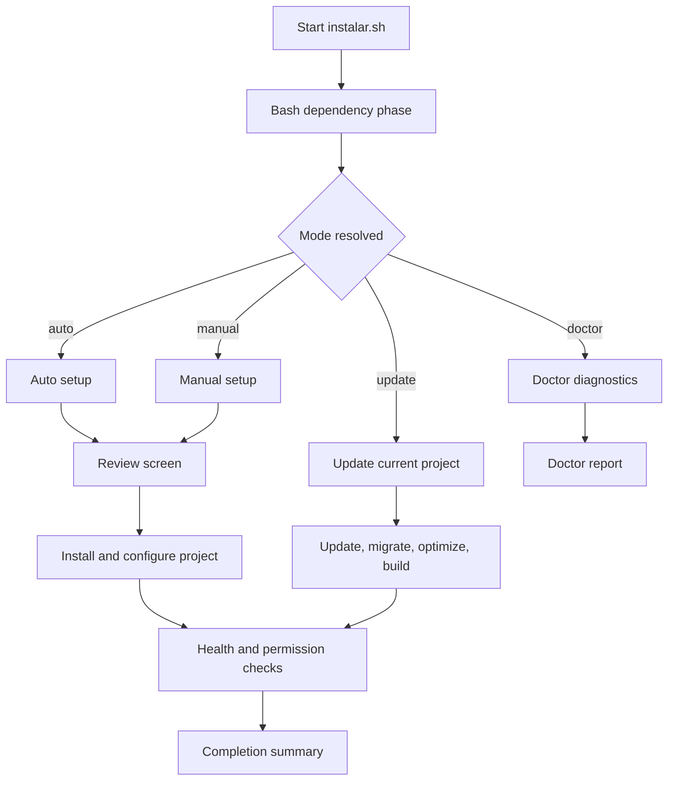
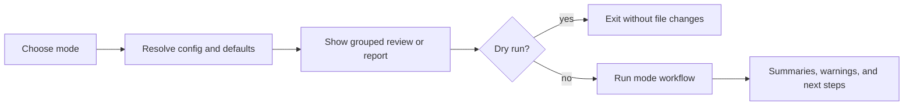

# INSTALAR

[](https://github.com/yezzmedia/Instalar/releases)
[](LICENSE)
[](https://www.php.net/)
[](https://laravel.com/)
[](https://filamentphp.com/)

Modern terminal setup, update, and diagnostics for Laravel 12 + Filament 5.

Made with <3 by [yezzmedia.com](https://yezzmedia.com) *(coming soon)*.

Current version: **0.1.17** (Rosie)

> [!NOTE]
> `instalar.sh` stays intentionally **single-file**:
> - Bash entrypoint for dependency checks, installs, and updates
> - Embedded Node runtime for guided setup, plans, and diagnostics

## Why INSTALAR

INSTALAR is for teams that want a **repeatable Laravel + Filament starting point** without manually replaying the same setup, package, build, and health-check steps every time.

It focuses on:

- **Fast starts** with `auto` mode
- **Safer custom runs** with `manual` mode and a final review screen
- **Maintenance runs** with `update` mode
- **Diagnostics** with `doctor` mode
- **Operational clarity** through dry-runs, log files, health checks, and concise recovery summaries

## Quick Start

```bash
chmod +x instalar.sh
./instalar.sh
```

Help:

```bash
./instalar.sh --help
```

Preview a run without changing files:

```bash
./instalar.sh --dry-run
```

## Choose Your Mode

| Mode | Best for | What it does |
|---|---|---|
| `manual` | First runs and custom stacks | Guided step-by-step setup with a grouped final review |
| `auto` | Fastest path | Opinionated project creation with a preset-driven package stack |
| `update` | Existing projects | Refreshes the current Laravel project, then rebuilds and rechecks it |
| `doctor` | Diagnostics and support | Audits the current Laravel project and suggests safe next steps |

## Common Flows

```bash
# Standard guided setup
./instalar.sh

# Fast non-interactive run using ./instalar.json
./instalar.sh --non-interactive

# Force manual mode with an explicit config file
./instalar.sh --non-interactive --mode manual --config ./instalar.json

# Replace an existing Laravel target and keep a backup
./instalar.sh --non-interactive --mode auto --allow-delete-existing --backup

# Replace a risky non-empty target only with the explicit high-risk override
./instalar.sh --non-interactive --mode auto --allow-delete-any-existing

# Update the current Laravel project
./instalar.sh --mode update

# Upgrade Composer dependencies during update mode
./instalar.sh --mode update --upgrade-dependencies

# Diagnose the current Laravel project without repair prompts
./instalar.sh --mode doctor --non-interactive --log-file ./doctor.log

# Apply dependency updates in the Bash dependency stage
./instalar.sh --deps-update

# Continue unattended runs even when final health checks fail
./instalar.sh --non-interactive --continue-on-health-check-failure
```

## What the Installer Does

- Creates new Laravel 12 projects with `laravel new`
- Supports `auto`, `manual`, `update`, and `doctor` modes
- Prints a resolved review screen before install or update work begins
- Supports preview-only runs with `--dry-run`
- Writes plain-text runtime logs with `--log-file <path>`
- Hides sensitive values in prompts and logs wherever possible
- Detects system dependencies and can install or update missing tooling
- Enforces minimum versions for required Bash-phase dependencies before the Node runtime starts
- Installs and configures Filament, Fortify, Boost, and optional packages
- Runs optimize, build, and health-check steps in a practical order
- Prints concise recovery guidance for failed Composer, npm, Artisan, and permission steps
- Offers narrow Doctor-mode repairs for a missing `.env` and stale Laravel caches where safe

## Installer Lifecycle



## Mode Lifecycle



## Run Controls

| Option | Description |
|---|---|
| `--help` | Show help |
| `--config <file>` | Load JSON configuration file |
| `--non-interactive`, `-y`, `--yes` | Run without prompts and use defaults/config |
| `--dry-run` | Resolve the run, print the review, and exit without changing files |
| `--print-plan` | Legacy alias for `--dry-run` |
| `--log-file <path>` | Write installer output to a plain-text log file |
| `--preset <minimal\|standard\|full>` | Choose the default optional package bundle |
| `--upgrade-dependencies` | Use `composer update` instead of the lockfile-safe default in update mode |
| `--skip-boost-install` | Skip the interactive `php artisan boost:install` step |
| `--continue-on-health-check-failure` | Continue unattended runs after failed final health checks |
| `--mode <auto\|manual\|update\|doctor>` | Force a specific mode |
| `--backup` | Backup an existing target directory before replacing it |
| `--admin-generate` | Generate the admin password instead of using `password` |
| `--allow-delete-existing` | Allow replacing an empty directory or detected Laravel project in unattended mode |
| `--allow-delete-any-existing` | Also allow replacing generic non-empty paths or Git repositories |
| `--start-server` | Run `composer run dev` automatically at the end |
| `--deps-update` | Apply detected dependency updates in the Bash phase |
| `--verbose` | Enable verbose output |
| `--debug` | Enable debug mode and show full command execution |

## Safety, Preview, and Logging Model

- Every install and update run resolves into a **grouped review screen** before execution.
- `--dry-run` resolves the same review, prints it, and exits without touching project files.
- `--log-file <path>` stores installer status lines and captured command context in plain text.
- Plan and log output never prints configured passwords in clear text.
- Interactive confirmations accept English answers only: `y`, `yes`, `n`, `no`.

### Safer unattended defaults

- `--allow-delete-existing` only covers:
  - empty directories
  - detected Laravel projects
- `--allow-delete-any-existing` is required for:
  - generic non-empty directories
  - Git-managed directories
- Root-level, home-directory, and current-working-directory protections remain in place.

## Presets and Package Selection

INSTALAR supports three package presets:

- `minimal` keeps the install lean
- `standard` adds a balanced default stack
- `full` adds a broader auth, monitoring, and DX stack

Manual mode also supports:

- optional package multi-select with categories and summaries
- custom normal Composer packages
- custom dev Composer packages
- starter flag selection for `laravel new`
- test suite selection (`Pest` or `PHPUnit`)

## Mode Details

### Auto

- Asks for the project name and a package preset
- Uses SQLite by default
- Uses Laravel starter flags: `--npm --livewire --boost --pest`
- Creates an admin account by default unless configured otherwise

### Manual

- Guides you through project, database, starter, package, admin, and Git decisions
- Includes a final review screen before anything is created or replaced
- Supports keyboard multi-select:
  - `Up/Down` move
  - `Space` toggle
  - `Enter` confirm
- Masks DB password prompts

### Update

- Works against the current Laravel project in the current directory
- Prints the detected package stack before execution
- Runs `composer install` by default to respect the current lockfile
- Only runs `composer update` when `--upgrade-dependencies` is set explicitly
- Continues with migrations, optimize, and frontend build steps after dependency sync

### Doctor

- Reuses the installer's health and permission checks
- Is report-only in `--non-interactive` and `--dry-run`
- Offers safe repair prompts only when interactive
- Prints grouped unresolved issues and recommended fixes at the end

## JSON Config for Unattended Runs

If `--config` is omitted, INSTALAR automatically loads `./instalar.json` when present.

Common top-level fields:

- `mode`: `auto`, `manual`, `update`, or `doctor`
- `preset`: `minimal`, `standard`, or `full`
- `nonInteractive`: `true` or `false`
- `dryRun` / `printPlan`
- `logFile`
- `skipBoostInstall`
- `continueOnHealthCheckFailure`
- `allowDeleteExisting`
- `allowDeleteAnyExisting`

Common install fields:

- `projectName`
- `projectPath`
- `database`
- `laravelFlags` / `laravelNewFlags`
- `optionalPackageIds`
- `normalPackages`
- `devPackages`
- `createAdmin`
- `admin`
- `gitInit`

Example:

```json
{
  "mode": "manual",
  "projectName": "Acme Portal",
  "projectPath": "./acme-portal",
  "preset": "standard",
  "database": {
    "connection": "sqlite"
  },
  "nonInteractive": true,
  "dryRun": true,
  "logFile": "./instalar.log"
}
```

## Doctor Mode

Doctor mode is the installer's support-friendly diagnostics pass for the **current** Laravel project.

It checks:

- `.env` / `APP_KEY`
- database connectivity
- storage symlink status
- Composer validation
- Artisan boot commands
- Vite manifest presence
- storage, bootstrap/cache, project, and `.env` permissions

Safe repair coverage:

- restore `.env` from `.env.example` when possible
- recreate `public/storage`
- clear and rebuild Laravel caches for certain failing Artisan checks

Doctor intentionally does **not** auto-fix:

- database configuration problems
- migration problems
- route/container issues beyond the safe cache reset
- frontend build failures
- permission ownership issues

## End-of-Run Checks

Install and update flows finish with:

1. Health checks
2. Permission checks
3. Optional `composer run dev`
4. A grouped completion summary with next commands

Health checks currently cover:

- `APP_KEY`
- database connectivity
- `public/storage`
- `composer validate`
- `php artisan about`
- `php artisan migrate:status`
- `php artisan route:list`
- `public/build/manifest.json`

## Nwidart / Modules Setup

When `nwidart/laravel-modules` is selected, INSTALAR automatically handles:

- `allow-plugins.wikimedia/composer-merge-plugin = true`
- merge-plugin include setup for `Modules/*/composer.json`
- removal of legacy `autoload.psr-4["Modules\\"]` when present
- Vite main-config adjustments for module asset loading
- module status bootstrap files and the base `Modules/` directory

## Troubleshooting

### The installer says a dependency is missing

- Re-run the script interactively and allow the Bash dependency phase to install or update tools
- Or install the missing dependency manually, then rerun the installer

### A dry-run works, but the real run fails later

- Re-run with `--log-file ./instalar.log`
- Re-run with `--verbose` or `--debug` for more command detail
- Use the printed recovery summary to rerun the failing command manually

### Doctor mode reports unresolved issues

- Follow the `Recommended Fixes` section in the Doctor report
- Re-run `./instalar.sh --mode doctor` after the manual fixes

### Vite manifest missing

- Run:

```bash
npm install
npm run build
```

### Permission issues remain

- Check ownership first
- Then try:

```bash
chmod -R ug+rw storage bootstrap/cache
chmod ug+rw .env
```

## Quality Gates

Local checks used for the installer itself:

```bash
node --test
node --test tests/*.cjs
bash -n instalar.sh
./instalar.sh --help
```

CI also runs:

- ShellCheck for the Bash phase
- Help output smoke checks
- Node-based installer regression coverage

## Release Shape

Recent releases focus on:

- CLI UX and onboarding
- safer unattended behavior
- better diagnostics and recovery summaries
- deterministic regression coverage

The expected release tag format is:

```text
v<version>-<codename>
```

For this release:

```text
v0.1.17-Rosie
```

## Project Layout

- `instalar.sh` - single-file installer
- `tests/` - Node-based regression, smoke, and consistency tests
- `.github/workflows/` - CI and release automation

## License

This project is open-sourced under the [MIT license](LICENSE).
